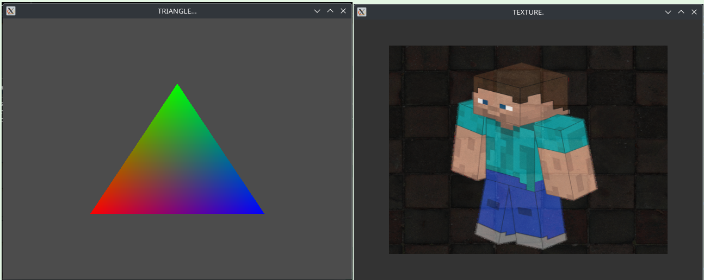

### Euphrates Engine
___
*documenting my opengl journey with a "graphics" engine *



### to run examples from the examples directory 
```  $ cargo run --example  ```

### open documentation

```  $ cargo doc --open     ```


### while running examples use keys 

- T : print errors with glfw 
- Y : print opengl errors 
- U : Draw in Polygon mode (LINE)
- I : Cancel Polygon mode (FILL)
- O : Draw in Polygon mode (Verticies only)
- W,A,S,D : Camera Controls